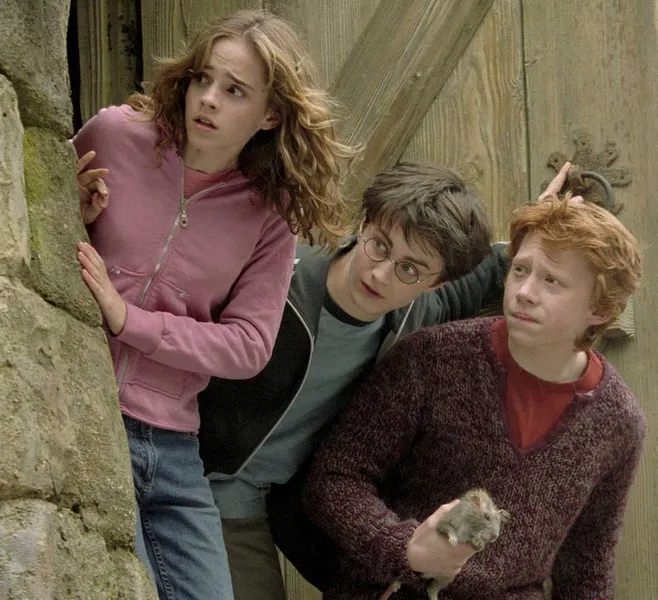
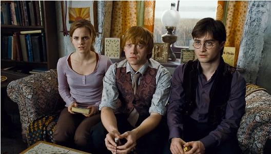
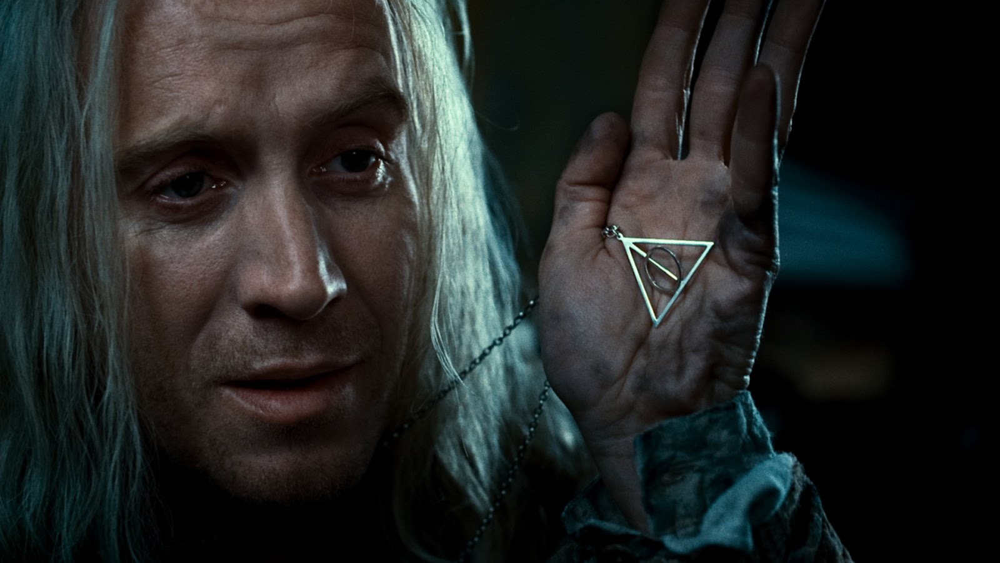
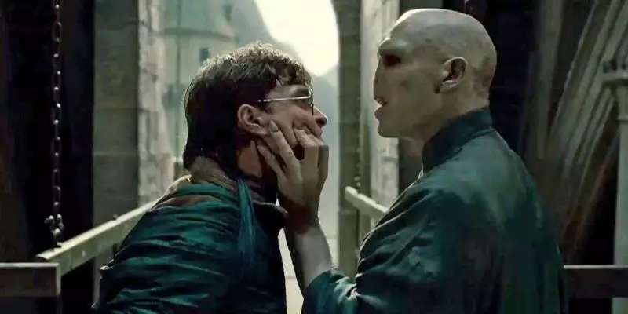

<a href="/bookReview">Voltar para a Página Inicial</a>

---

# Harry Potter and the Deathly Hallows

## Uma jornada épica para a conclusão

**Harry Potter and the Deathly Hallows**, o sétimo e último livro da aclamada série escrita por J.K. Rowling, é mais do que apenas uma história de magia e aventuras. É um conto profundo sobre amizade, coragem e sacrifício, culminando em uma batalha épica entre o bem e o mal.

---

### Introdução

A trama começa com Harry, Hermione e Ron abandonando Hogwarts para embarcar em uma missão perigosa: encontrar e destruir as Horcruxes de Voldemort, pedaços da alma do vilão que garantem sua imortalidade. Diferentemente dos livros anteriores, aqui o foco está fora de Hogwarts, o que confere à narrativa um tom sombrio e um senso constante de urgência.

---

### O peso da amizade

A relação entre o trio de protagonistas é testada ao limite. Entre desentendimentos, perigos iminentes e perdas devastadoras, a força do vínculo deles é uma das colunas centrais do livro. Um momento particularmente impactante é quando Ron retorna após abandonar o grupo, provando que a amizade verdadeira supera até as maiores adversidades.

---

### O mistério das Relíquias da Morte

Além das Horcruxes, o livro apresenta o conceito das Relíquias da Morte: a Varinha das Varinhas, a Pedra da Ressurreição e a Capa da Invisibilidade. Estas relíquias lendárias simbolizam o poder supremo, mas também o perigo de sucumbir à ganância e à obsessão. A história das Relíquias é um dos trechos mais envolventes da obra.

---

### A batalha de Hogwarts

O clímax do livro acontece na icônica batalha de Hogwarts. Essa sequência não é apenas visualmente impressionante, mas também emocionalmente carregada. Personagens queridos sacrificam suas vidas, e os laços de lealdade são testados. É aqui que Harry enfrenta Voldemort em um confronto final que define o destino do mundo bruxo.

---

### Temas principais

1. **Sacrifício**: O tema do sacrifício é onipresente. Desde a morte dos pais de Harry até o próprio ato de auto-sacrifício de Harry, a ideia de entregar-se pelo bem maior permeia a narrativa.

2. **Escolhas e moralidade**: "São nossas escolhas, Harry, que mostram quem realmente somos", dizia Dumbledore. Este livro explora como as escolhas moldam o caráter, contrastando as decisões de Harry e Voldemort.

3. **Amor como poder supremo**: A mensagem final do livro é clara: o amor é a força mais poderosa, capaz de vencer até a magia mais sombria.

---

### Conclusão

**Harry Potter and the Deathly Hallows** é um final digno para uma das séries mais amadas da literatura moderna. Com sua mistura de ação, emoção e profundidade temática, o livro não apenas encerra a saga de Harry, mas também deixa lições duradouras para leitores de todas as idades.

Se você é fã da série, esta obra irá emocionar, inspirar e, acima de tudo, deixar uma marca inesquecível em seu coração.

<a href="/bookReview">Voltar para a Página Inicial</a>
